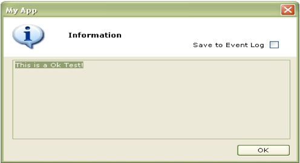
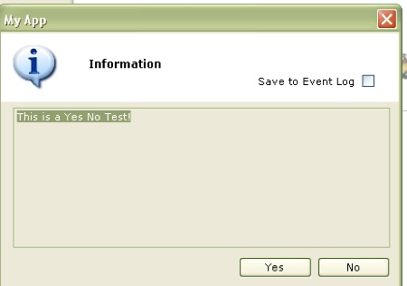
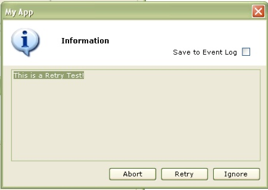
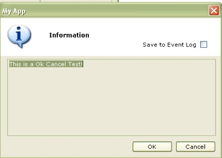
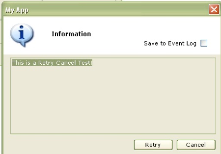
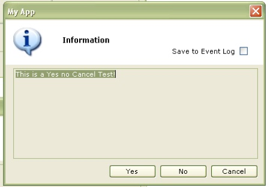
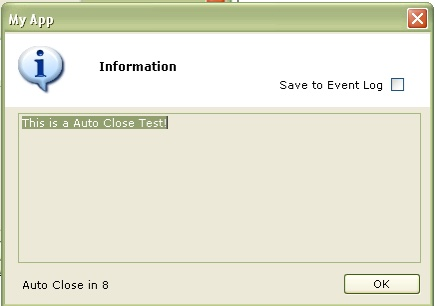
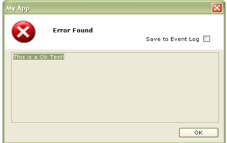
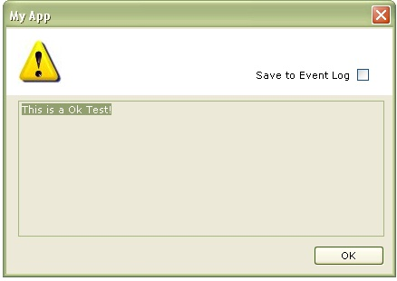
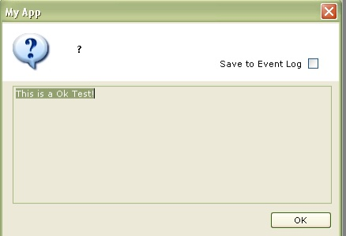

# BurnSoft.MsgBox

The BurnSoft Message Box Control was created to allow long messages to be displayed without filling up the screen.  There have been some messages that would make the standard message box scroll off the screen.  With this customized control the long messages will be displayed in a multi-text text box.

To almost match the same functionality as the message box that comes with VB and VB.Net, it will allow you to set the form style and button style.  To Help save some of the information, it will also give you the option of saving the message to the event log.



## How To Use:
Copy the Component to your project, add the “BurnSoft.MsgBox” Control as a reference and import it into your code ( “Imports BurnSoft.MsgBox”).  When you need to call the message box, you will to reference it to an object.

### Example:
```
Private Sub ok_Click(ByVal sender As System.Object, ByVal e As System.EventArgs) Handles ok.Click
        Dim Obj As New MsgClass
        Dim strMessage As String = "This is a Ok Test!"
        Dim strTitle As String = "My App"
        Obj.DoMessage(strMessage, BSMsgBox.MgboxStyle.Inf_OK, BSMsgBox.MgBtnStyle.mb_Information, strTitle)
    End Sub
```

In the Example Above is executed, it will display the following message box:


Just like the normal message box, it can return the values of the button.  In the next example it will display the Yes No button style.  In the code, I will check to see which one was selected.


```
Private Sub Button4_Click(ByVal sender As System.Object, ByVal e As System.EventArgs) Handles Button4.Click
        Dim Obj As New MsgClass
        Dim strMessage As String = "This is a Yes No Test!"
        Dim strTitle As String = "My App"
        Dim MyReturn As String = Obj.DoMessage(strMessage, BSMsgBox.MgboxStyle.Inf_YesNo, BSMsgBox.MgBtnStyle.mb_Information, strTitle)
        If MyReturn = vbYes Then
            MsgBox("You selected yes")
        Else
            MsgBox("You selected no")
        End If
    End Sub
```

As you can see in the code above, I will set the value from the message box into the MyReturn string variable.  Then I will compare the value to see if it is equal to the vbYes or vbNo values, and react from that.

The rest is pretty simple, you can use the same vb calls that you would with the normal message box function (vbYes, vbNo, vbRetry, vbCancel, vbIgnore, vbAbort)

Here are the parameters of the DoMessage Function

```
Public Function DoMessage(ByVal mPrompt As String, Optional ByVal mButtons As MgboxStyle = MgboxStyle.Inf_OK, _
 Optional ByVal mStyle As MgBtnStyle = MgBtnStyle.mb_Information, _
 Optional ByVal mTitle As String = "My Application", _
 Optional ByVal AutoClose As AutoCloseTimer = AutoCloseTimer.ac_0Sec, _
 Optional ByVal AlwaysOnTop As Boolean = False, _
 Optional ByVal MsgText As String = "")
```

### Button Styles:
The button styles will just display the type of buttons that you want displayed to your user.

#### OK


#### YES NO


#### RETRY


#### Ok/Cancel

#### Retry/Cancel

#### Yes/No/Cancel

#### AutoClose


### Form Styles
The Form styles just define the message box type, you have Information, Information, Critical, Exclamation, and Question.

#### Information

#### Critical

#### Exclamation

#### Question

#### Pass/Failed


Hopefully you have found this .Net Component as useful as we have.  It’s quick and easy to use.  If you have any questions or comments, please feel free to let use know

[](https://www.paypal.com/cgi-bin/webscr?cmd=_s-xclick&hosted_button_id=JSW8XEMQVH4BE)]

## Change Log

### v2.2.355.3458
* Added Pass/Failed Option, which will return 1 for Pass and 0 for Failed
* REFACTOR - Got rid of the Inf for the MgBoxStyle and the mb in the MbBtnStyle

### v2.2.354.3457
* Fixed nuget package

### v2.2.354.3456
* Fixed display issue in type header ( issues #7 )

### v2.2.354.3455
* Initial re-release of code after finding it in a archives from over 10 years ago.  Added Comments to code
* Converted original PDF to this README.md file.
* Added help file
* Converted original install method from a windows installer in 2008 to a nugget package.